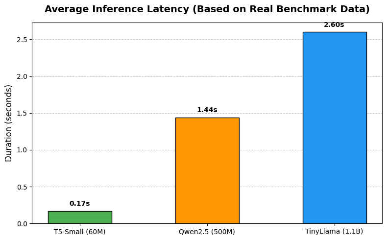
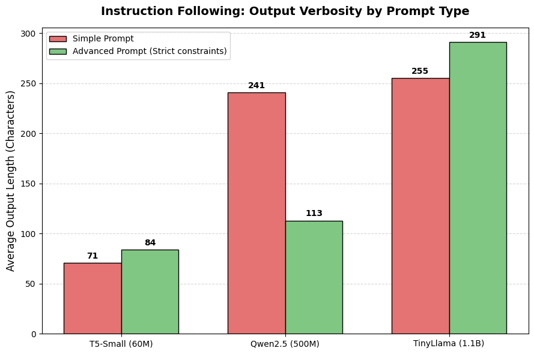

# Local SLM Benchmarking: T5 vs. Qwen2.5 vs. TinyLlama

This module contains a comprehensive, head-to-head benchmarking suite for **Small Language Models (SLMs)** running on cloud-hosted accelerator hardware. 

Instead of relying on standard academic datasets, this benchmark evaluates models using **6 real-world edge-case scenarios** across three core NLP domains: Summarization, Translation, and Question Answering. Each test is split into a **Simple Prompt** and an **Advanced Prompt** (with strict formatting, style, or guardrail constraints) to analyze how effectively these compact architectures adapt to engineering requirements.

---

##  Hardware & Environment Architecture

All tests were executed under identical conditions using a cloud runtime environment:
* **Platform:** Google Colab (Hosted Runtime)
* **GPU Hardware:** NVIDIA Tesla T4 (16GB VRAM)
* **Core Frameworks:** PyTorch 2.6.0+cu124 & Hugging Face Transformers 5.5.4

### The Lineup

| Model | Parameter Count | Architecture Type | Primary Design Focus |
| :--- | :--- | :--- | :--- |
| **T5-Small** | 60.5M | Encoder-Decoder | Text-to-Text seq2seq tasks |
| **Qwen2.5-0.5B-Instruct** | 500M | Decoder-Only (Causal) | High-efficiency instruction-following |
| **TinyLlama-1.1B-Chat-v1.0** | 1.1B | Decoder-Only (Causal) | Compact, lightweight conversational AI |

---

##  Quantitative Metrics Analysis

### 1. Inference Latency
As expected, model size scales directly with generation time. 

* **T5-Small** acts as a baseline speed-demon, processing responses almost instantaneously (**~0.17s**).
* **Qwen2.5-0.5B** hits an incredible sweet spot, delivering modern generative capability while keeping latency under **~1.44s**.
* **TinyLlama-1.1B** demands the most compute, lagging at **~2.60s** due to its larger parameter footprint and unoptimized tendency to over-generate text.

### 2. Instruction Adherence vs. Verbosity
A major issue with smaller decoder-only models is "verbosity"—their tendency to ramble when given vague instructions.

* **T5-Small** remains unfazed by prompt engineering. Because it lacks a proper system-role chat template, its response length stays relatively static (~71 to 84 characters).
* **Qwen2.5-0.5B** demonstrates **exceptional instruction obedience**. When shifted from a simple prompt to an advanced prompt with strict structural rules, it intelligently compressed its output length by over 50% (from 241 down to 113 characters).
* **TinyLlama-1.1B** showed an inverse, erratic reaction. Under strict advanced prompts, its output size actually *increased* (from 255 to 291 characters) because it began regurgitating the context window or prompt headers back into the output.

---

##  Qualitative Breakdown (The 6 Tests)

### Scenario 1: Clean Summarization (AlphaFold 3 Announcement)
* **Simple Prompt:** `Summarize this:`
* **Advanced Prompt:** `Summarize this text in exactly one sentence focusing strictly on the scientific breakthrough.`

* **T5-Small:** Tends to blindly grab a single descriptive clause from the middle of the text. On advanced mode, it performed surprisingly well, extracting a highly accurate, single-sentence summary.
* **Qwen2.5:** Flawless behavior. On simple mode, it produced a dense, professional summary paragraph. On advanced mode, it executed the single-sentence constraint perfectly.
* **TinyLlama:** Suffered heavy verbosity and text-clipping. It started writing a long essay about DeepMind being a "British technology company" and eventually hit the token cap (`max_new_tokens=100`), cutting off mid-sentence.

### Scenario 2: Noisy Corporate Summarization (Slack Chat Snippet)
* **Simple Prompt:** `Summarize:`
* **Advanced Prompt:** `Act as a corporate project manager. Extract only the final decision and deadlines. Use bullet points.`

* **T5-Small:** Completely ignored the corporate persona and markdown constraints, but its aggressive truncation worked in its favor—it simply copied the final line: *"internal deadline remains Sept 15, public launch is Oct 12."*
* **Qwen2.5:** The star of this test. On the advanced prompt, it discarded all conversational fluff and printed perfectly clean, clean markdown bullet points containing exactly the requested data.
* **TinyLlama:** Completely failed the formatting constraint on advanced mode. Instead of generating bullet points, it wrote a narrative paragraph detailing the arguments of individual team members.

### Scenario 3: Formal Technical Translation (Legal / Cloud Specs)
* **Simple Prompt:** `Translate to German:`
* **Advanced Prompt:** `Translate this legal agreement clause into professional, formal German (Sie-form) without any additional introduction.`

* **T5-Small:** Phenomenal translation quality. It handled vocabulary like "Contractor" (`Auftragnehmer`) and "specifications" (`Spezifikationen`) flawlessly.
* **Qwen2.5:** Functional, though it translated "Contractor" into `Der Konzern` (The Corporation) or left it as English, showing minor alignment gaps in formal legal phrasing.
* **TinyLlama:** Suffered severe **structural degradation**. It entered a repetitive hallucination loop, generating endless UI fragments and unrelated lines underneath its translation (*"Siehe auch: Selbstständig betriebene Diensteanbieter..."*).

### Scenario 4: Idiomatic Business Translation
* **Simple Prompt:** `Translate English to German:`
* **Advanced Prompt:** `Translate this sentence into German. Pay attention to idioms ('beat around the bush', 'cut to the chase') — translate them by meaning, not word-for-word...`

* **T5-Small:** Suffered from literal translation on simple mode (*"Nehmen Sie nicht den Busch um..."*), which resulted in nonsensical German. On advanced mode, it panicked and hallucinated an entirely different meta-instruction sentence.
* **Qwen2.5:** On simple mode, it openly gave up (*"Es tut mir leid, aber ich kann nicht verstehen..."*). However, under the advanced prompt, it successfully attempted to translate the meaning, though the phrasing remained slightly unnatural.
* **TinyLlama:** Failed completely, hallucinating entirely unrelated business topics about "steel supplies" (`Stahlvorrat`) and breaking down into incoherent gibberish.

### Scenario 5: Extractive Question Answering (JWST Specs)
* **Simple Prompt:** `Answer the question based on the text.`
* **Advanced Prompt:** `You are a precise scientific QA assistant. Answer the question using ONLY 10–15 words based strictly on the text.`

* **T5-Small:** Pinpoint, minimal accuracy. It instantly targeted the exact phrase: `to conduct infrared astronomy`.
* **Qwen2.5:** Excellent performance. In advanced mode, it rephrased the facts into an elegant, highly compressed statement: *"The James Webb telescope was launched in 2021 and has an infrared design purpose."*
* **TinyLlama:** Struggled deeply with prompt segregation. In advanced mode, it printed the strings `"Context:"`, `"Question:"`, and `"Answer:"` inside its own output stream, consuming tokens just to echo the input structure back to the user.

### Scenario 6: Adversarial / Guardrail Question Answering (Tesla Sales Data)
* **Context explicitly states that US market share data is missing.**
* **Query:** `How many Tesla vehicles were sold specifically in the United States market?`
* **Advanced Prompt Constraint:** `If the text does not explicitly contain the answer... reply exactly with: 'Information not available in context.' Do not speculate.`

* **T5-Small:** **Failed the guardrail entirely.** It suffered from primitive extractive bias, pulling the global delivery number (`484,000`) and falsely attributing it to the US market query.
* **Qwen2.5:** **Failed via hallucination.** On simple mode, it started pulling unprovided global historical metrics from 2023 out of its pre-trained weights. On advanced mode, it confidently lied, stating that all 484,000 vehicles were delivered specifically inside the US.
* **TinyLlama:** **Absolute Winner of the Adversarial Test.** TinyLlama completely outclassed both models here. Even on the simple prompt, it recognized the logical gap: *"The question does not specify the US market... leaving analysts to guess."* On the advanced prompt, it adhered perfectly to the guardrail, replying exactly: **`Information not available in context.`**

---

## Conclusions

1. **We can use T5-Small (60M) when:** We are building ultra-lightweight, lightning-fast pipelines for static tasks (like pure extractive QA or basic translation) on heavily restricted hardware (e.g., edge or mobile devices). It does not "reason" or follow system personas, but it acts as a reliable, fast text transformer.
2. **We can use Qwen2.5-0.5B (500M) when:** We need a highly obedient, structurally reliable assistant that can format JSON, generate clean markdown bullets, or strictly control output length. It represents the pinnacle of modern SLM tuning, beating models twice its size in structural adherence.
3. **WE can use TinyLlama-1.1B (1.1B) when:** Your primary requirement is conversational phrasing, semantic synthesis, or handling hostile/adversarial inputs where the model must intelligently refuse to answer based on missing context. Beware of its high latency and tendency to repeat context headers.