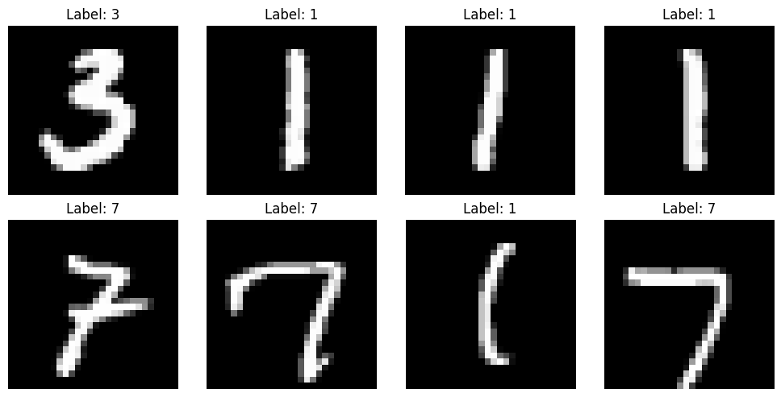
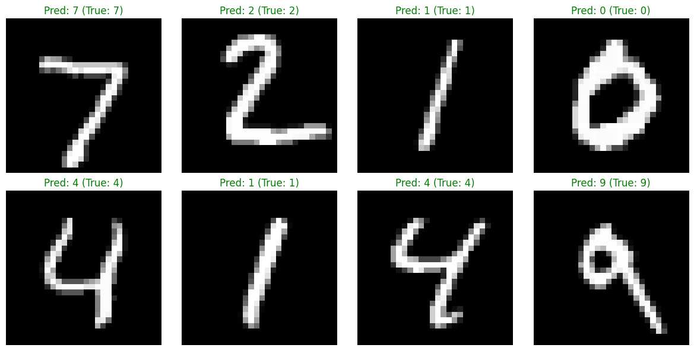

# MNIST Digit Classifier using PyTorch

This repository contains a clean, production-ready Jupyter Notebook implementing a Feedforward Neural Network (Multi-Layer Perceptron) to classify handwritten digits using PyTorch.

---

## 💡 What is the MNIST Dataset & Why Does It Matter?

The **MNIST dataset** (Modified National Institute of Standards and Technology) is a collection of 70,000 grayscale images of handwritten digits (0 through 9), each sized 28x28 pixels. 

In the machine learning community, MNIST holds massive **cultural significance**:
* **The "Hello World" of ML:** Just as software engineers print `"Hello, World!"` when learning a new language, ML engineers build an MNIST classifier as their very first deep learning pipeline.
* **The Ultimate Sandbox:** Originally popularized by Yann LeCun in 1998, MNIST served as the gold standard benchmark for computer vision for over a decade.
* **Sanity Check:** Even today, top researchers use MNIST as a quick "sanity check" to verify if a new optimization algorithm works fundamentally before scaling it up to massive complex tasks.

---

## 🛠️ What We Did in This Project

Instead of just running a script, we built an interactive pipeline divided into logical steps:

1. **Data Pipeline & Normalization:** Loaded the dataset using `torchvision` and normalized pixel values (mean 0.1307, std 0.3081) for stable network convergence.
2. **Exploratory Visualization:** Plotted random training batches to visually verify data loading integrity before training.
3. **Architecture:** Designed a robust Multi-Layer Perceptron (MLP):
   * **Flatten Layer:** Reshapes 28x28 images into a 784-element input vector.
   * **Hidden Layer:** 128 neurons utilizing **ReLU** activation.
   * **Output Layer:** 10 neurons mapping directly to raw digit class scores.
4. **Training Strategy:** Optimized using **Adam** (learning rate: 0.001) paired with **Cross-Entropy Loss**, tracking history metrics across every single batch step.
5. **Inference & Mismatch Verification:** Evaluated performance on unseen test data and plotted real-time predictions. 

---

## 📊 Training Performance & Results

### Hardware Acceleration
The network pipeline was computed using hardware-accelerated environments:
* **Target Device:** `cuda` (**NVIDIA Tesla T4 GPU**)

### Convergence History
The model trained for **3 epochs**, demonstrating a rapid decline in loss metrics and immediate model convergence:
* **Epoch 1:** Loss: `0.1754`
* **Epoch 2:** Loss: `0.0134`
* **Epoch 3:** Loss: `0.0444`

### Final Test Evaluation
* **Final Test Accuracy:** **`97.52%`** 🎯

---

## 🖼️ Project Visualizations

### 1. Training Dataset Samples
Below is a sample snapshot of the handwritten digits from the training batch loaders that our neural network processed:



### 2. Model Evaluation & Inference Tests
The following visualization shows our model's live performance on completely unseen test data. Correctly recognized targets are flagged in green:



---

## 🚀 How to Run

1. Clone this repository:
```bash
   git clone ...
   cd mnist-classifier-pytorch

```

2. Install dependencies:

```bash
   pip install -r requirements.txt

```

3. Open and run the notebook:

```bash
   jupyter notebook

