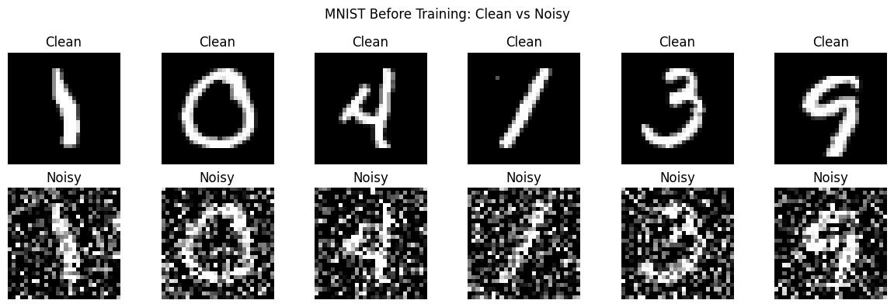
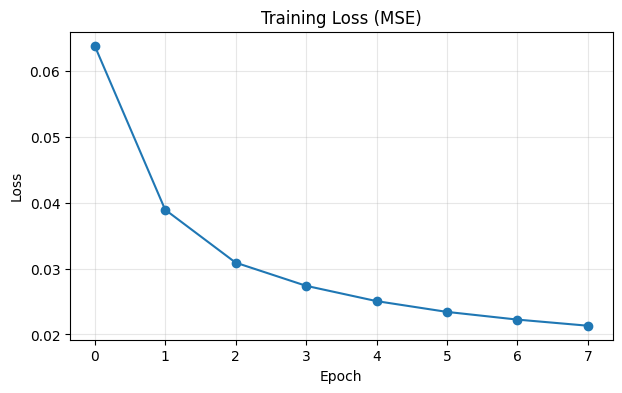
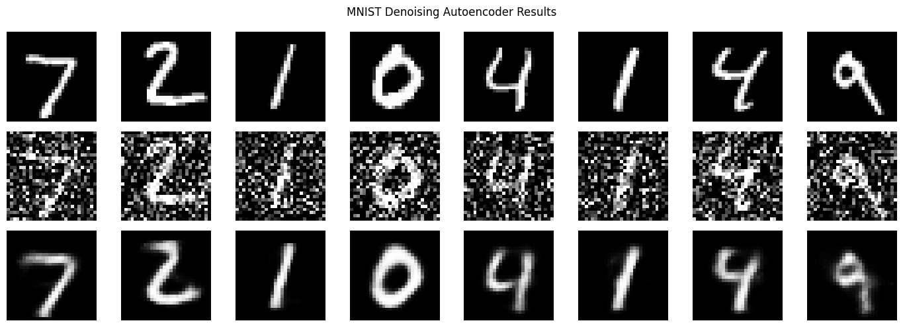

# MNIST Denoising Autoencoder (PyTorch)

A clean portfolio project that learns to remove random noise from MNIST digits using a fully connected denoising autoencoder.

## What Is a Denoising Autoencoder?

A denoising autoencoder is a neural network trained to reconstruct clean inputs from corrupted versions.

- **Input**: noisy image
- **Target**: original clean image
- **Goal**: learn compact features that preserve important structure while ignoring noise

In this project, the model sees noisy MNIST digits and predicts the clean digit image.

## Why This Matters in ML

Unsupervised reconstruction tasks are an essential concept because they help us:

- learn meaningful latent representations without class labels
- build intuition about feature compression and reconstruction
- improve robustness to imperfect or noisy real-world data

This is a strong bridge between basic supervised learning and more advanced representation learning.

## Project Structure

```text
Mnist-denoising-autoencoder/
├─ mnist_denoising_autoencoder.ipynb
├─ requirements.txt
└─ README.md
```

## Setup

```bash
pip install -r requirements.txt
jupyter notebook
```

Open `mnist_denoising_autoencoder.ipynb` and run the cells top to bottom.

## Notebook Flow

1. Imports and device setup (CUDA/MPS/CPU)
2. MNIST loading
3. Random noise function
4. Noisy vs clean visualization
5. Autoencoder definition
6. Training with MSE loss and Adam
7. Final reconstruction grid (Original / Noisy / Reconstructed)

## Results and Photos

These are the main visuals from the project. They show the noisy input before training, how the loss changes over time, and the final reconstruction quality.

### 1. MNIST Before Training



### 2. Training Loss



### 3. Final Denoising Result



## Notes

- Default image size: `28 x 28`
- Input is flattened to `784` features for the fully connected encoder/decoder
- Loss function: Mean Squared Error (`MSELoss`)
