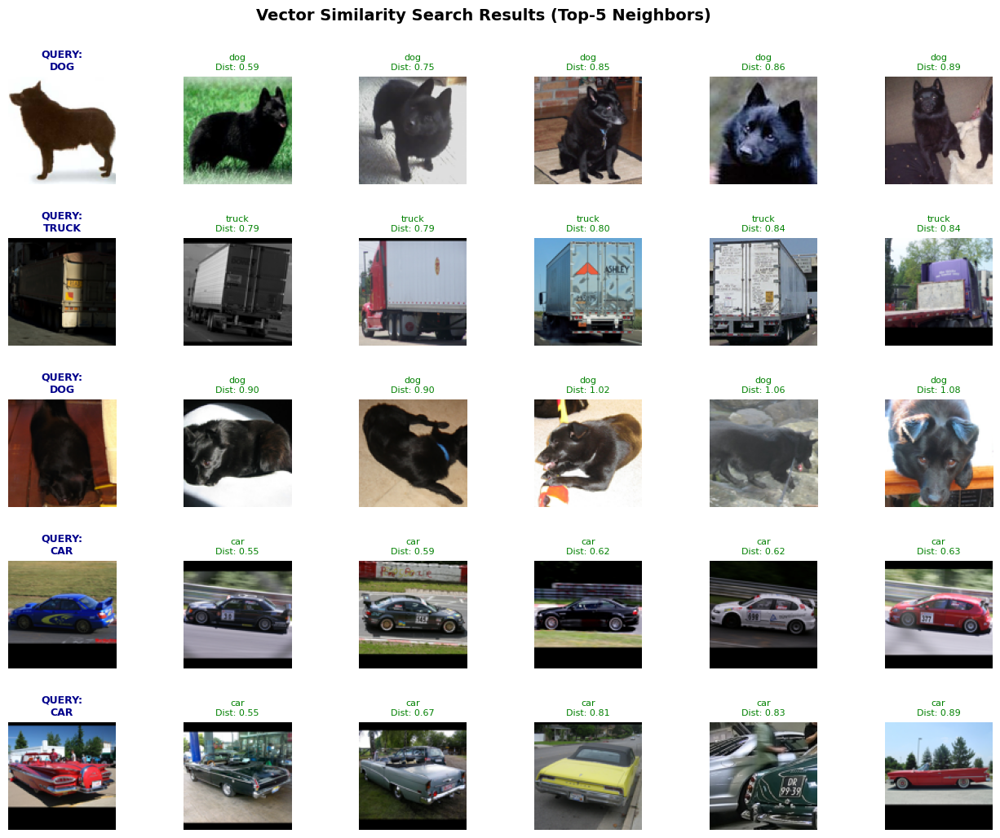
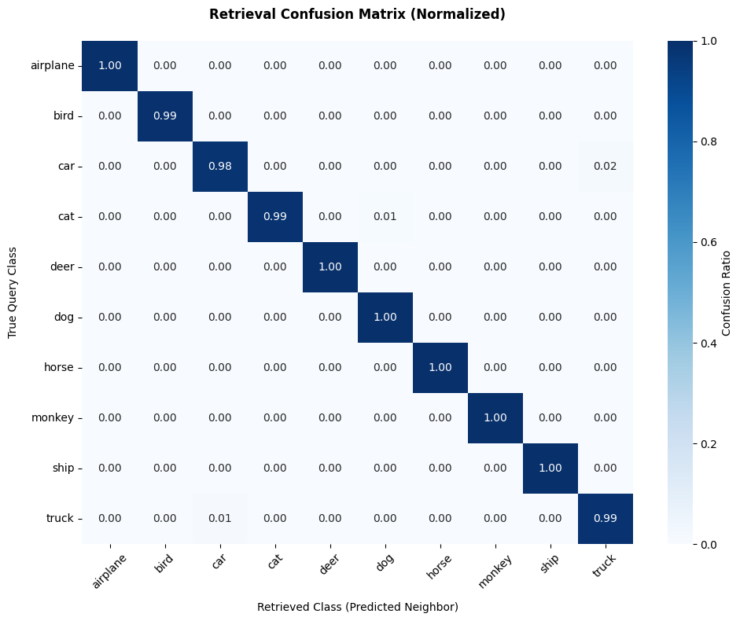
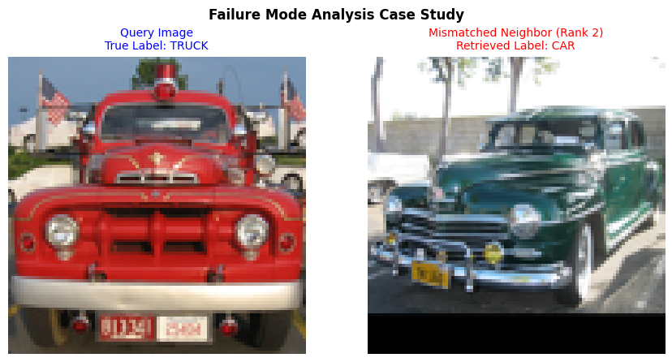

# Content-Based Image Retrieval (CBIR) Engine using Self-Supervised Embeddings

This project implements a high-performance **Semantic Image Search & Retrieval Engine** utilizing Meta's State-of-the-Art **DINOv2** Vision Transformer (ViT) for dense feature extraction and Facebook AI's **FAISS** for fast, optimized vector similarity operations. 

By mapping unstructured image data into a continuous latent space where visual concepts, textures, and contexts align, the engine achieves an outstanding **99.41% Mean Precision @ Top-5** on out-of-distribution evaluation data.

---

## 📊 Core Performance Metrics & Hardware Execution

| Metric / Parameter | Value / Specification |
| :--- | :--- |
| **Feature Extractor Model** | `facebook/dinov2-base` (Self-Supervised ViT) |
| **Output Latent Dimension** | 768 dimensions per image vector |
| **Vector Index Type** | `faiss.IndexFlatL2` (Exact L2 Euclidean Match) |
| **Hardware Accelerator** | NVIDIA Tesla T4 GPU |
| **Feature Extraction Time** | ~3 minutes total execution time (8,000 test / 5,000 train) |
| **Dataset Configuration** | STL-10 (10 Classes) |
| **Total Gallery Mismatches** | 235 slots missed across 40,000 retrieval ranks |
| **Retrieval Accuracy (Mean Precision @ Top-5)** | **99.41%** |

---

## 🚀 Pipeline Architecture

1. **Data Engineering:** Serialization of nominal target classes into dense categorical layouts via PyTorch One-Hot Encoding (`torch.Size([5000, 10])`). Subsampling and structural transformation of standard target arrays (`(3, 96, 96)`) to match requirements of ViT backbones ($224 \times 224$ pixels).
2. **Feature Extraction:** Leveraging a frozen self-supervised transformer network to eliminate label bias, generating highly generalized feature matrix embeddings.
3. **GPU-Accelerated Indexing:** Feeding normalized matrix rows natively into a FAISS spatial index for instantaneous distance tracking.

---

## 📈 Visual Search Inference Examples

Below is a dynamic sample of query instances mapped against their top-5 nearest neighbors retrieved from the training database. Visual matches are color-coded (green text denotes verified correct class affinity).

---

## 📉 System Evaluation & Error Diagnostics

### 1. Retrieval Confusion Matrix Analysis
To ensure global optimization stability, a comprehensive validation pass was conducted across all 8,000 hidden test samples. The normalized confusion profile illustrates near-flawless diagonal alignment.

The heatmap indicates that minor confusion boundaries only exist within closely aligned micro-environments—specifically between heavy transportation units (`truck`) and standard structural passenger units (`car`) at a minor $1\%$ to $2\%$ ratio.

### 2. Failure Mode Analysis (Case Study)
Out of 40,000 evaluated rank slots, the system isolated exactly **235 mismatches**, demonstrating exceptional zero-shot representational transferability. Inspecting these edge-cases uncovers critical insights into how self-supervised models interpret spatial semantics.

* **The Mismatch:** A query featuring a vintage red `TRUCK` returned a classic dark green `CAR` at Rank 2.
* **Deep Insight:** Rather than failing blindly, DINOv2 correctly identified premium macro-level geometric properties. Both vehicles feature distinct mid-20th-century design choices: prominent chrome front grilles, rounded fender flares, circular standalone headlights, and structured hood trim lines. 
* **Conclusion:** This proves that the latent space organization in DINOv2 favors rich structural textures, environmental lighting fields, and historical aesthetic design over arbitrary, nominal human classification definitions.

---

## 🛠️ Technology Stack
* **Deep Learning Framework:** PyTorch & Torchvision
* **Transformers Hub:** Hugging Face `transformers`
* **Vector Database Engineering:** FAISS-GPU (`faiss-gpu`)
* **Data Processing & Analytics:** NumPy, Pandas, Scikit-Learn
* **Visualization Suites:** Seaborn, Matplotlib, tqdm